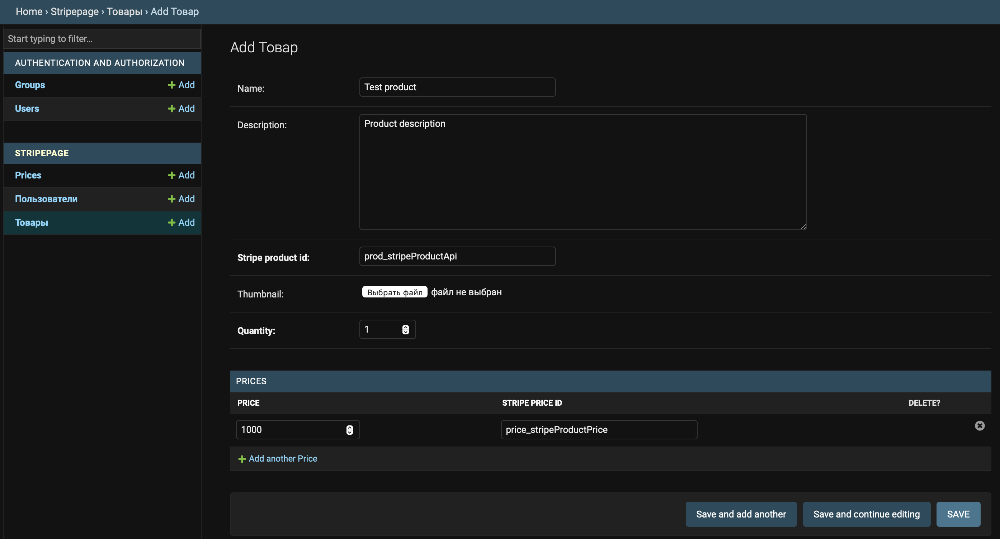
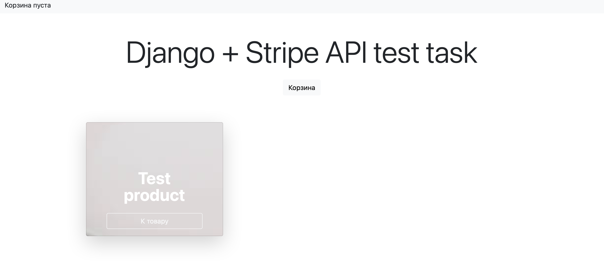
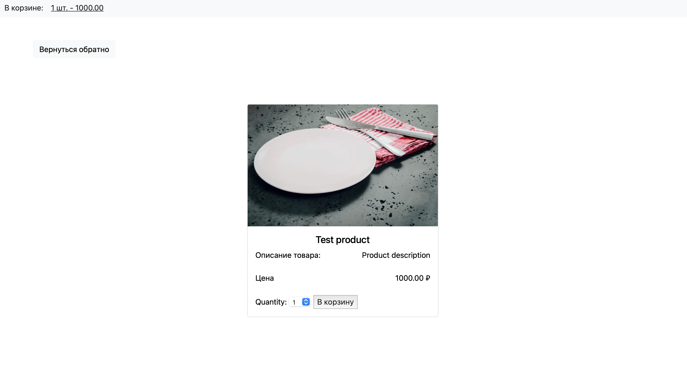
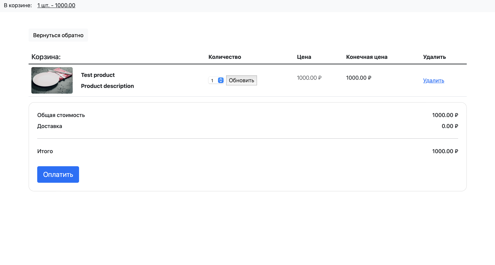
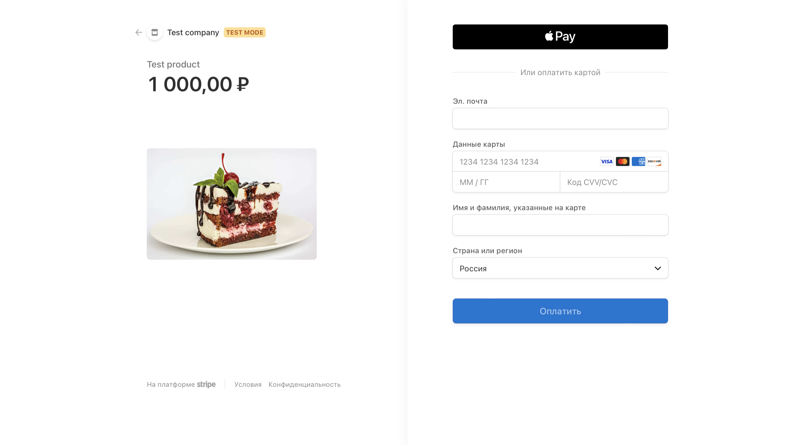

# Django + Stripe API

В сервисе реализована корзина, которая хранит выбранные пользователем товары в сессии. 

### Установка

Перед запуском сервиса необходимо добавить ключи `STRIPE_PUBLIC_KEY` и `STRIPE_SECRET_KEY` в 
`docker-compose.yml` 

Все необходимые миграции выполнены предварительно.

```
- sudo docker-compose up
- sudo docker-compose build
```

### Как добавить товар?
В Django Admin Panel необходимо добавить товар таким образом: <br/>


Данные для входа в Django Admin Panel: <br/>
Логин: `admin` <br/>
Пароль: `admin`

### Как выглядит сервис?
* 
* 
* 
* 